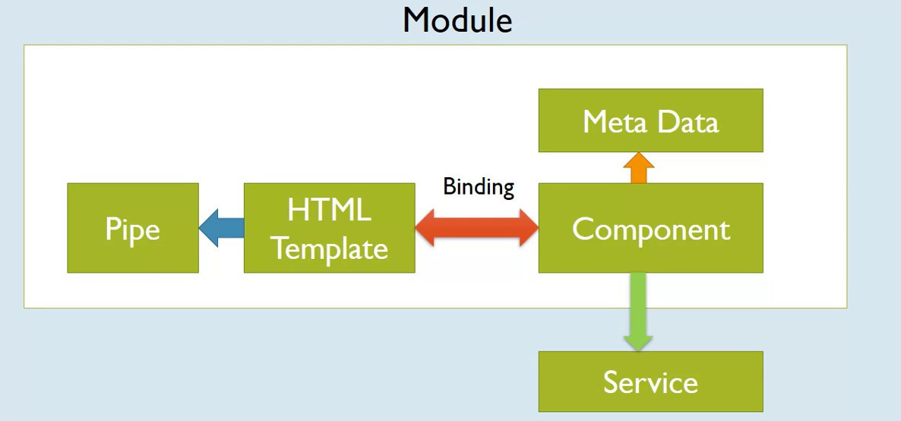

export { bytexTheme as theme, Provider  } from './theme'
import { CodeSurfer } from "mdx-deck-code-surfer"
import { Image } from 'mdx-deck'


## `Angular`

```notes
some cool hidden notes for speaker
```
---


#### We're a software company from Eastern Europe who provides software development services & consultancy.

---


#### We've worked with companies in fields such as networking, cybersecurity, cloud & storage, banking or IoT.
#### We believe in good UX design, based on the deep understanding of user needs.
#### We fully trust the power of QA automation & we have the mindset and professionals to prove it.
#### We also have teams of experienced developers, using the latest digital technologies and best practices.
---

---
## Trainers
- Cristian Pînzaru
- George Moscu
- Robert Maftei
- Radu-Alexandru Burcuta

#### Ne puteti contacta pe: `FiiPractic@bytex.ro`

---

# Let's begin!

---
## Variables, Scope, Hoisting and Closure
---
### Variables
A `variable` is a named container used for storing values

---
<CodeSurfer
notes="Variables"
dark="true"
code={require("raw-loader!./snippets/scope-closure-hoisting/variables.es6")}
/>
---
### Variable Scope
`Scope` in JavaScript refers to the current context of code, which determines the accessibility of variables to JavaScript.

---
### Variable Scope
The two types of scope are `local` and `global`:
- `local`
- `global`

---
<CodeSurfer
notes="Variable Scope"
dark="true"
code={require("raw-loader!./snippets/scope-closure-hoisting/scope.es6")}
steps={[
  { range: [0, 1], notes: "Initialize a global variable"},
  { range: [3, 7], notes: "named function" },
  { range: [4, 4], notes: "Initialize a local, function-scoped variable" },
  { range: [8, 10], notes: "Log the global and local variable" }
]}
/>

---
### Hoisting
`Hoisting` is a behaviour where `variable` and `named` `function` declarations are moved to the `top` of their `scope`.

---
<CodeSurfer
title="Hoisting - Variable"
dark="true"
code={require("raw-loader!./snippets/scope-closure-hoisting/hoisting.es6")}
steps={[
  { lines: [1, 4, 6], notes: "lets take these 3 statements" },
  { lines: [1], notes: "we log a `message` variable" },
  { lines: [4], notes: "then declare, and assign a value to it." },
  { lines: [6], notes: "then then log it again." },
  { range: [1, 2], notes: "We would expect a ReferenceError at the first log" },
  { range: [1, 7], notes: "but because of hoisting" },
  { range: [9, 16], notes: "The interpreter will read this" },
  { range: [1, 16] },
]}
/>
---
### Closure
We say that a `variable` is `kept` in a `closure` when it is referenced by another `function` after the function that `defined it` has `finished execution`.
---
<CodeSurfer
title="Closure"
dark="true"
code={require("raw-loader!./snippets/scope-closure-hoisting/closure.es6")}
steps={[
  { lines: [1, 13], notes: "we'll create a `wallet` function that receives an initial amount" },
  { lines: [1, 2, 13], notes: "we'll keep a variable to store our `money` and set it to `amount`" },
  { lines: [1, 2, 4,5,6, 13], notes: "we'll create a function to add a value to our current amount" },
  { lines: [1, 2, 4,5,6, 8,9,10, 13], notes: "and one to view our current amount" },
  { lines: [1, 2, 4,5,6, 8,9,10,12, 13], notes: "and return an object with those functions as properties" },
  { range: [1, 15], notes: "we can then create our wallet" },
  { range: [1, 17], notes: "add to it" },
  { range: [1, 18], notes: "and see how much we have" },
]}
/>
---
## Data structures
---
### Primitives
In JavaScript there are 5 primitive types:
- `undefined`
- `null`
- `boolean`
- `string`
- `number`

---
<CodeSurfer
notes="Variables"
dark="true"
code={require("raw-loader!./snippets/data-structures/primitives.es6")}
/>
---
### Objects
`Objects` in JavaScript, just as in many other programming languages, can be compared to objects in real life. The concept of objects in JavaScript can be understood with real life, tangible objects.

---
<CodeSurfer
notes="Objects"
dark="true"
code={require("raw-loader!./snippets/data-structures/objects.es6")}
/>
---
### List (Array)
The JavaScript `Array` object is a global object that is used in the construction of arrays; which are high-level, list-like objects.
---
<CodeSurfer
notes="Arrays"
dark="true"
code={require("raw-loader!./snippets/data-structures/array.es6")}
/>

---
## Array Methods
---
### `Array.isArray()`

The `Array.isArray()` method determines whether the passed value is an `Array`.
---
<CodeSurfer
notes=""
dark="true"
code={require("raw-loader!./snippets/array-methods/is-array.es6")}
/>
---
### `Array.prototype.forEach()`

The `forEach()` method executes a provided function once for each array element.
---
<CodeSurfer
notes=""
dark="true"
code={require("raw-loader!./snippets/array-methods/for-each.es6")}
/>
---
### `Array.prototype.indexOf()`

The `indexOf()` method returns the first index at which a given element can be found in the array, or -1 if it is not present.
---
<CodeSurfer
notes=""
dark="true"
code={require("raw-loader!./snippets/array-methods/index-of.es6")}
/>
---
### `Array.prototype.join()`

The `join()` method creates and returns a new string by concatenating all of the elements in an array.
---
<CodeSurfer
notes=""
dark="true"
code={require("raw-loader!./snippets/array-methods/join.es6")}
/>
---
### Add/Get/Remove Items
---
<CodeSurfer
dark="true"
code={require("raw-loader!./snippets/array-methods/add-get-remove-items-part1.es6")}
steps={[
  {lines: [1], notes: "Create an array of strings"},
  {lines: [2], notes: "Use Array.push to add an item to the end of array"},
  {range: [2, 4], notes: "Array length changed to 4"},
  {range: [6, 7], notes: "Items of array"},
  {range: [7, 9], notes: "Use Array.pop to extract an item from the end of array"},
  {range: [7, 11], notes: "Extracted item"},
  {range: [13, 14], notes: "Items of array"},
  {range: [14, 16], notes: "Use Array.shift to extract an item from the beginning of array"},
  {range: [14, 18], notes: "Extracted item"},
  {range: [20, 22], notes: "Items of array"},
  {range: [20, 23], notes: "Use Array.unshift to add an item to the beginning of array"},
  {range: [20, 25], notes: "Array length changed to 3"},
  {range: [27, 29], notes: "Items of array"},
]}
/>
---
<CodeSurfer
dark="true"
code={require("raw-loader!./snippets/array-methods/add-get-remove-items-part2.es6")}
steps={[
  {range: [1, 2], notes: "From index 1, remove 1 element"},
  {range: [1, 3], notes: "Array.splice method will return the removed item/items from array"},
  {range: [1, 7], notes: "Our array with 'Fortnite' item removed"},
  {lines: [9], notes: "Our initial array"},
  {range: [9, 10], notes: "From index 1, remove 1 element and replace it with another ('StarCraft')"},
  {range: [9, 12], notes: "Array.splice method will return the removed item/items from array"},
  {range: [9, 15], notes: "Our array with 'Fortnite' item replaced with 'StarCraft'"},
  {lines: [17], notes: "And again, our initial array"},
  {range: [17, 18], notes: "From index -1(on step from the end of the array), remove 0 elements and insert 'StarCraft'"},
  {range: [17, 20], notes: "Array.splice method will return an empty array, because we didn't removed any items"},
  {range: [17, 23], notes: "Our array with 'StarCraft' item added on index before end of the array"},
]}
/>
---
<CodeSurfer
dark="true"
code={require("raw-loader!./snippets/array-methods/add-get-remove-items-part3.es6")}
steps={[
  {lines: [1], notes: "Create an array of strings"},
  {range: [1, 4], notes: "Get the items from index 1 until index 3, but without item from index 3"},
  {range: [1, 6], notes: "We got the correct result"},
  {lines: [6, 9], notes: "Get the first 2 items of array"},
  {lines: [6, 9, 10, 11], notes: "We got the correct result"},
  {lines: [6, 9, 12, 13], notes: "Again, our array didn't changed"},
  {lines: [13, 16], notes: "Get the last 2 items of array"},
  {lines: [13, 16, 17, 18], notes: "We got the correct result"},
  {lines: [13, 16, 19, 20], notes: "Again, our array didn't changed"},
]}
/>
---
<CodeSurfer
dark="true"
code={require("raw-loader!./snippets/array-methods/add-get-remove-items-part4.es6")}
steps={[
  {range: [1, 2], notes: "Create an array of strings and an undefined variable"},
  {lines: [1, 4], notes: "Merge  `games` array with another array and return the result"},
  {lines: [1, 4, 5, 6], notes: "We got the correct result, but what happen with our array?"},
  {lines: [1, 4, 7, 8], notes: "Nothing. Our array didn't changed"},
  {lines: [8, 10], notes: "Merge  `games` array with another arrays and return the result"},
  {lines: [8, 10, 11, 12], notes: "We got the correct result"},
  {lines: [8, 14], notes: "Merge  `games` array with another array and a string and return the result"},
  {lines: [8, 14, 15, 16], notes: "We got the correct result"},
 ]}
/>
---
### Transform an array
---
<CodeSurfer
dark="true"
code={require("raw-loader!./snippets/array-methods/transform-an-array-part1.es6")}
steps={[
  {range: [1, 13], notes: "Transform the games array into an array of strings using the name property"},
  {range: [1, 15], notes: "We got the expected response"},
  {range: [1, 17], notes: "Our array didn't changed"},
  {range: [19, 20], notes: "Array.sort will sort our array"},
  {range: [19, 22], notes: "The items are sorted as strings by default"},
  {lines: [22, 24], notes: "We'll pass a callback to Array.sort to handle the sort strategy"},
  {range: [22, 26], notes: "We got the correct order"},
  {range: [26, 28], notes: "Array.reverse will reverse the order of the elements in arr (not sort)"},
  {range: [26, 30]},
]}
/>
---
### Array.reduce
The callback is applied to the items. You may notice the familiar arguments, starting from the 2nd

- `item` – is the current array item.
- `index` – is its position.
- `arr` – is the array.

---
### Array.reduce
But there’s one more argument

- `previousValue` – is the result of the previous function call, initial for the first call.

---
<CodeSurfer
dark="true"
code={require("raw-loader!./snippets/array-methods/transform-an-array-reduce.es6")}
/>
---
## ES2015(`ES6`)

`ES2015` is a major update to JavaScript that includes dozens of new features.
---
### `let` vs const

`let` is a new feature introduced in ES6 and it's essentially a block scoped version of var. Its scope is limited to the block, statement or expression where it's defined, and all the contained inner blocks.
---
### let vs `const`

Variables declared with `var` or `let` can be changed later on in the program, and reassigned. Once a `const` is initialized, its value can never be changed again, and it can't be reassigned to a different value.
---
### Arrow Functions

`Arrow` functions, since their introduction, changed forever how JavaScript code looks (and works).
---
<CodeSurfer
dark="true"
code={require("raw-loader!./snippets/es-6-ts/arrow-functions.es6")}
/>
---
<CodeSurfer
dark="true"
code={require("raw-loader!./snippets/es-6-ts/arrow-fn-vs-constructors.es6")}
steps={[
  {range: [1, 7], notes: "'this' will have the function reference"},
  {range: [9, 15], notes: "'this' will have the value of the first ancestor which has a this reference"},
  {range: [17, 17], notes: "Will run without problems. This will create an instance of the constructor function"},
  {range: [19, 21], notes: "An error will be thrown and the 'arrowFunctionInstance' variable will be undefined"},
  {lines: [23, 25], notes: "'hello world' will be displayed in console"},
  {range: [26, 28], notes: "An error will be thrown. Uncaught ReferenceError: arrowFunctionInstance is not defined"},
]}
/>
---
### Classes

ECMAScript committee decided to sprinkle syntactic sugar on top of prototypical inheritance so that it resembles how class-based inheritance works in other popular implementations.
---
<CodeSurfer
dark="true"
code={require("raw-loader!./snippets/es-6-ts/class.es6")}
/>
---
### Destructuring assignments
Given an object, you can extract just some values and put them into named variables
---
<CodeSurfer
dark="true"
code={require("raw-loader!./snippets/es-6-ts/destructuring.es6")}
/>
---
## TypeScript
`TypeScript` is an open-source programming language developed and maintained by Microsoft. It is a strict syntactical superset of JavaScript, and adds optional static typing to the language.
---
### Types
- Boolean - `boolean`;
- Number - `number`;
- String - `string`;
- Array - `[]`, `number[]`, `string[]`
- Object - `object`
- Enum - `enum`
- Any - `any`
- Void - `void`
---
### Interfaces
An `interface` is a syntactical contract that an entity should conform to. In other words, an interface defines the syntax that any entity must adhere to.
---
<CodeSurfer
dark="true"
code={require("raw-loader!./snippets/es-6-ts/interface.ts")}
/>
---
### Classes
TypeScript allow developers to use these techniques now, and compile them down to JavaScript that works across all major browsers and platforms, without having to wait for the next version of JavaScript.
---
<CodeSurfer
dark="true"
code={require("raw-loader!./snippets/es-6-ts/class.ts")}
steps={[
  {range: [1, 11], notes: ""},
  {range: [1, 22], notes: ""},
  {range: [24, 33], notes: ""},
  {lines: [35], notes: ""},
  {lines: [36], notes: ""},
  {lines: [35, 38], notes: ""},
  {lines: [36, 39], notes: ""},
]}
/>
---
### `public`, `private`, and `protected` modifiers
---
<CodeSurfer
dark="true"
code={require("raw-loader!./snippets/es-6-ts/visibility.ts")}
/>
---
## Angular
Angular is a TypeScript-based open-source full-stack web application framework led by the Angular Team at Google and by a community of individuals and corporations

---
### Architecture
- `Modules`
- `Components`
- `Templates, directives, and data binding`
- `Services and dependency injection`
- `Routing`
---
### Modules (NgModules)
An NgModule is a class marked by the `@NgModule` decorator. `@NgModule` takes a metadata object that describes how to compile a component's template and how to create an injector at runtime.
---
<CodeSurfer
dark="true"
code={require("raw-loader!./snippets/angular/ng-modules.ts")}
steps={[
  {range: [1, 8], notes: ""},
  {range: [8, 22], notes: ""},
  {lines: [23], notes: ""}
]}
/>

---
### Components
A `component` defines a class that contains application data and logic, and is associated with an HTML template that defines a view to be displayed in a target environment.
---
<CodeSurfer
dark="true"
code={require("raw-loader!./snippets/angular/component.ts")}
steps={[
  {range: [1, 5], notes: ""},
  {range: [6, 17], notes: ""}
]}
/>
---
### Templates, directives, and data binding
- A `template` combines HTML with Angular markup that can modify HTML elements before they are displayed
- Template `directives` provide program logic
- `binding markup` connects your application data and the DOM
---
<CodeSurfer
dark="true"
code={require("raw-loader!./snippets/angular/component.html")}
/>
---
### Services and dependency injection
For data or logic that isn't associated with a specific view, and that you want to share across components, you create a service class. A service class definition is immediately preceded by the `@Injectable()` decorator
---
<CodeSurfer
dark="true"
code={require("raw-loader!./snippets/angular/service.ts")}
steps={[
  {range: [1, 3], notes: ""},
  {range: [4, 18], notes: ""},
  {range: [20, 28], notes: ""}
]}
/>
---
### Routing
The Angular `Router` NgModule provides a service that lets you define a navigation path among the different application states and view hierarchies in your app.

---
### Architecture Overview

---

---
## Angular CLI
---
### NPM - `Node package manager`

`npm` is a package manager for the JavaScript programming language. It is the default package manager for the JavaScript runtime environment Node.js.
---

### `npm install -g @angular/cli`

After runnig this, npm will install `ng` command, created by Google. With this you will be able to create new services, components etc.. and mentain them.
---

### `ng new` cool-project `{--style=scss}` `{--routing}`
This will create a new Angular project with `cool-project` name. The attributes in brackets are optional.
---
`--style=scss` will tell your application to set the style for scss preprocessor
---
`--routing` will add a routing module.

---
### `ng serve` {--port 4200}
Will start our project and it can be accessed by `localhost:4200`

---
### `ng generate {path/to/}component`
Will create a component in the specified path. If the path doesn't exits, it will be created.

---
## Angular CLI docs
https://cli.angular.io/

---
## Angular Docs
https://angular.io/