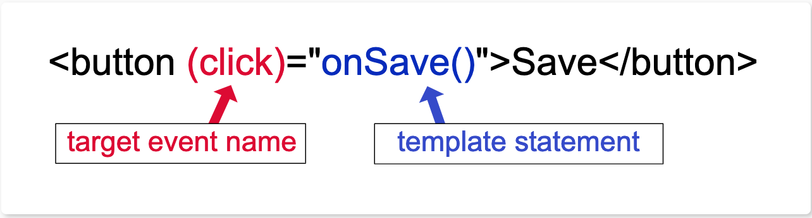
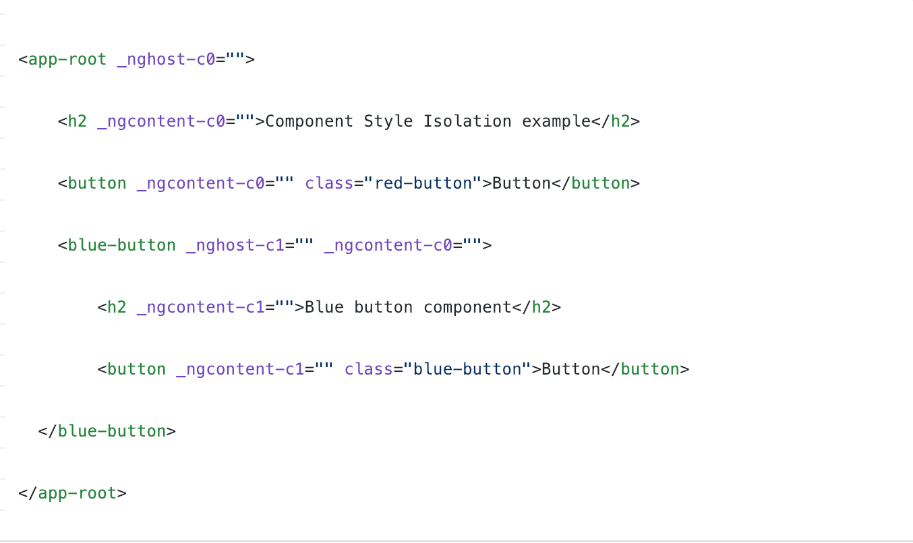
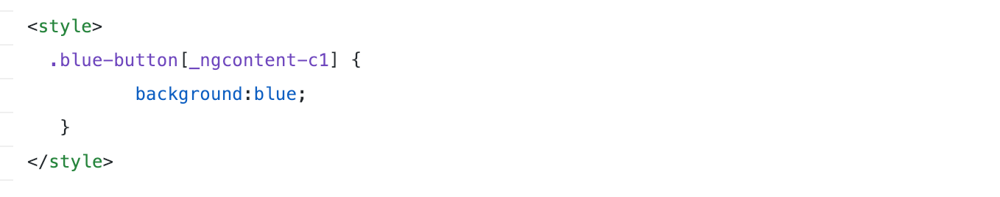

export { bytexTheme as theme, Provider  } from './theme'
import { CodeSurfer } from "mdx-deck-code-surfer"
import { Image } from 'mdx-deck'

### `FII Practic Session 2`

### Angular

---

### `What is a Component ?`
---

Components are the most basic UI building block of an Angular app. An Angular app contains a tree of Angular components.

---

### `How can I display data ?`

---

You can display data by binding controls in an HTML template to properties of an Angular component.

---

<CodeSurfer
title="Interpolation"
dark="false"
code={require("raw-loader!./src/app/demos/life-cycle-hooks.ts")}
steps={[
  {range: [9, 17]},
]}
/>
---

### `Updating them`
Angular executes template expressions after every change detection cycle. Change detection cycles are triggered by many asynchronous activities such as promise resolutions, HTTP results, timer events, key presses and mouse moves.

---

### `About best practices:`
Although it's possible to write complex template expressions, it's a better practice to avoid them.

---

### `But what are template statements ?`
A template statement has a side effect. That's the whole point of an event. It's how you update application state from user action.

---

---

### `Lifecycle Hooks`
Angular offers lifecycle hooks that provide visibility into these key life moments and the ability to act when they occur.

---

### Hooks and Sequence
`ngOnChanges()`, `ngOnInit()`, `ngDoCheck()`, `ngAfterContentInit()`, `ngAfterContentChecked()`, `ngAfterViewInit()`, `ngAfterViewChecked()`, `ngOnDestroy()`

---
<CodeSurfer
title="Hooks Component"
dark="false"
code={require("raw-loader!./src/app/demos/life-cycle-hooks.ts")}
steps={[
  {range: [19, 25], notes: "Hooks implementation."},
  {range: [27, 33], notes: "Constructor (not a lifecycle hook)"},
  {range: [33, 38], notes: "OnChanges"},
  {range: [38, 43], notes: "ngOnInit"},
  {range: [44, 59], notes: "All others"},
  {range: [59, 62], notes: "OnDestroy"},
]}
/>

---
<CodeSurfer
title="AfterViewInit Component"
dark="false"
code={require("raw-loader!./src/app/demos/after-view-init.ts")}
steps={[
  {range: [37, 53], notes: "AfterViewInit hook."}
]}
/>

---
### Component Interaction
Pass data from parent to child with input binding.
Use ``@Input decorator``.

---
### Component Interaction
Parent listens for child event.
Use ``@Output decorator``.

---
<CodeSurfer
title="Component Interaction"
dark="false"
code={require("raw-loader!./src/app/demos/after-view-init.ts")}
steps={[
  {range: [18, 28], notes: "Input, Output and 2 more."},
  {range: [27, 37], notes: "ViewChild and local variable"}
]}
/>

---
<CodeSurfer
title="Parent and children communicate via a service."
dark="false"
code={require("raw-loader!./src/app/demos/component-interaction.service.ts")}
/>

---
<CodeSurfer
title="Component that subscribes."
dark="false"
code={require("raw-loader!./src/app/demos/component-interaction.ts")}
/>

---
### Component Styles
The styles specified in @Component metadata apply only within the template of that component.

---
Changes to styles elsewhere in the application don't affect the component's styles.

---
You can co-locate the CSS code of each component with the TypeScript and HTML code of the component, which leads to a neat and tidy project structure.

---
You can change or remove component CSS code without searching through the whole application to find where else the code is used.

---
How ?

---

---

---

## `Pipes`
A pipe takes in data as input and transforms it to a desired output

---

<CodeSurfer
title="Pipes"
dark="true"
code={require("raw-loader!./src/app/pipes/even.pipe.ts")}
steps={[
  {range: [2, 6], notes: "Input decorator"},
  {range: [4, 4], notes: "Pipe name"},
  {range: [5, 5], notes: 'Use impure pipes in very special cases'},
  {range: [7, 7], notes: ''},
  {range: [8, 10], notes: ''},
]}
/>

---

<CodeSurfer
title="Use the pipe"
dark="true"
code={require("raw-loader!./src/app/components/even-component/even.component.ts")}
steps={[
  {range: [9, 9], notes: ''},
]}
/>

---

<CodeSurfer
title="Use the pipe"
dark="true"
code={require("raw-loader!./src/app/components/even-component/even.component.html")}
steps={[
  {range: [2, 3], notes: 'The even values will be displayed'},
  {range: [5, 6], notes: 'The odd values will be displayed'},
]}
/>

---

## `Structural directives`

---

<CodeSurfer
title="Structural Directives"
dark="true"
code={require("raw-loader!./src/app/components/structural-directives/structural-directive.component.html")}
steps={[
  {range: [1, 7], notes: 'ngIf is used for displaing or not elements in page'},
  {range: [3, 3], notes: ''},
  {range: [5, 5], notes: ''},
  {range: [9, 15], notes: ''},
  {range: [17, 22], notes: ''},
  {range: [24, 30], notes: 'Cum puteti comunica cu o componenta si invers'},
  {range: [26, 26], notes: ''},
  {range: [28, 28], notes: ''},
  {range: [32, 32], notes: ''},
  {range: [33, 33], notes: ''},
  {range: [36, 36], notes: ''},
]}
/>

---

# Services && Routing
Let's see that in practice

---

# `Va multumim!`
