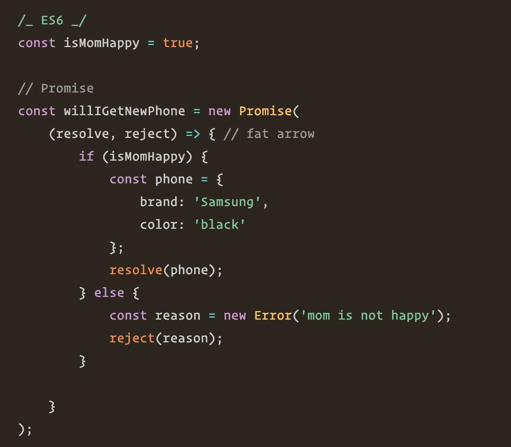

export { bytexTheme as theme, Provider  } from './theme'
import { CodeSurfer } from "mdx-deck-code-surfer"
import { Image } from 'mdx-deck'

### `FII Practic Session 3`

---

# Promises

---

"Imagine you are a kid. Your mom promises you that she'll get you a new phone next week."

You don't know if you will get that phone until next week. Your mom can either really buy you a brand new phone, or stand you up and withhold the phone if she is not happy :(.

---

That is a promise. A promise has 3 states. They are:

Pending: You don't know if you will get that phone
Fulfilled: Mom is happy, she buys you a brand new phone
Rejected: Your mom is happy, she withholds the phone

---

---

---

ES7 introduce async and await syntax. It makes the asynchronous syntax look prettier and easier to understand, without the .then and .catch.

---

<CodeSurfer
title="ES7 Async and Await"
dark="false"
code={require("raw-loader!./src/promises.ts")}
steps={[
  {range: [1, 19], notes: "ES7 Promise"},
  {range: [21, 31], notes: "Async"},
  {range: [33, 51], notes: "Execution"},
]}
/>
---

# Why promises ?

---
If you add the numbers with normal function, you get the result immediately. However when you issue a remote call to get result, you need to wait, you can't get the result immediately.

---

# RxJS

---

# Events

---

# APIs Requests

---

## HttpClient

`HttpClient` is a service provided by Angular which provides functionalities to comunicate with servers through HTTP ajax calls

---

<CodeSurfer
  title="Http Methods"
  dark="false"
  code={require("raw-loader!./src/examples/http.service.ts")}
  steps={[
    {range: [7, 7], notes: "How to import HttpClient"},
    {range: [10, 17], notes: "Get data from server"},
    {range: [11, 11], notes: "HttpClient.get method"},
    {range: [12, 13], notes: "Response in success case"},
    {range: [14, 16], notes: "Response in error case"},
    {range: [19, 34], notes: "HttpClient.post method"},
    {range: [20, 21], notes: "HttpClient.post method"},
    {range: [22, 22], notes: "Object to send"},
    {range: [23, 32], notes: "HttpClient options"},
    {range: [36, 39], notes: "HttpClient.put method"},
    {range: [41, 44], notes: "HttpClient.delete method"},
  ]}
/>

---

# Finish
