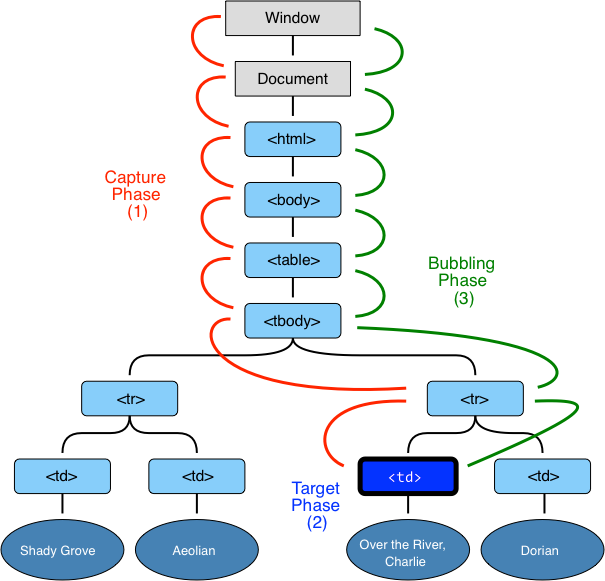

export { bytexTheme as theme, Provider  } from './theme'
import { CodeSurfer } from "mdx-deck-code-surfer"
import { Image } from 'mdx-deck'

### `FII Practic Session 4`
---

# Events

---

<CodeSurfer
  title="How to access an event"
  dark="false"
  code={require("raw-loader!./src/events/events.ts")}
  steps={[
    {range: [1, 1], notes: "Target event"},
    {range: [3, 3], notes: "With 'on-' prefix"},
    {range: [5, 6], notes: "Event Listeners"}
  ]}
/>

---

All events on <a href="https://developer.mozilla.org/en-US/docs/Web/Events" target="_blank" rel="noopener">MDN</a> 😍

---

## Event listeners

---

<CodeSurfer
  title="Event listeners methods"
  dark="false"
  code={require("raw-loader!./src/events/event-listener.ts")}
  steps={[
    {range: [3, 3], notes: ""},
    {range: [4, 5], notes: ""}
  ]}
/>

---

## Event Bubbling
Event what?

---

### Event Bubbling
When an `event` happens on an element, it first runs the handlers on it, then on its parent, then all the way up on other ancestors.

---

<CodeSurfer
  title="Event Bubbling"
  dark="false"
  code={require("raw-loader!./src/events/bubbling.html")}
  steps={[
    {range: [1, 5], notes: "How is this happening"},
    {range: [7, 9], notes: "How to stop propagation"}
  ]}
/>

---

### Event flow

---

## Angular's events example
👉<a href="https://stackblitz.com/angular/gxmkxadkqyy" target="_blank" rel="noopener">example</a>👈

---
# NgModules

`NgModules` configure the injector and the compiler and help organize related things together.
---

## Angular modularity

Modules are a great way to organize an application and extend it with capabilities from external libraries.
---
## NgModule metadata

 * Declares which components, directives, and pipes belong to the module.
 * Makes some of those components, directives, and pipes public so that other module's component templates can use them.
 * Imports other modules with the components, directives, and pipes that components in the current module need.
 * Provides services that the other application components can use.
---
## JavaScript Modules vs. NgModules

JavaScript and Angular use modules to organize code, and though they organize it differently, Angular apps rely on both.
---

### JavaScript modules

In JavaScript, modules are individual files with JavaScript code in them. To make what’s in them available, you write an export statement, usually after the relevant code.
---
<CodeSurfer
  title="Javascript Module"
  dark="false"
  code={require("raw-loader!./src/ng-modules/js-modules.ts")}
  steps={[
    {lines: [1], notes: "Exporting Javascript module"},
    {lines: [3], notes: "Importing Javascript module"}
  ]}
/>
---
### NgModules

NgModules are classes decorated with `@NgModule`
---
### NgModules
 * An NgModule bounds declarable classes only.
 * Instead of defining all member classes in one giant file as in a JavaScript module, you list the module's classes in the @NgModule.declarations list.
 * An NgModule can only export the declarable classes it owns or imports from other modules.
 * Unlike JavaScript modules, an NgModule can extend the entire application with services by adding providers to the @NgModule.providers list.
---
<CodeSurfer
  title="Basic Module"
  dark="false"
  code={require("raw-loader!./src/ng-modules/basic.ts")}
  steps={[
    {range: [1, 7], notes: "Imports: Angular Modules and JS modules"},
    {range: [10, 22], notes: "@NgModule decorator with its metadata"},
    {lines: [23], notes: "Module class"}
  ]}
/>

---
# Proiecte

 - Termen de predare 13 aprilie
 - Veti veni primii 5 la sediul Bytex pe 17 aprilie
 - Premiere pe 20 aprilie

---

# Finish
